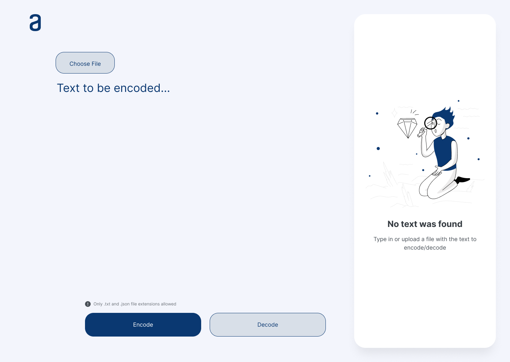
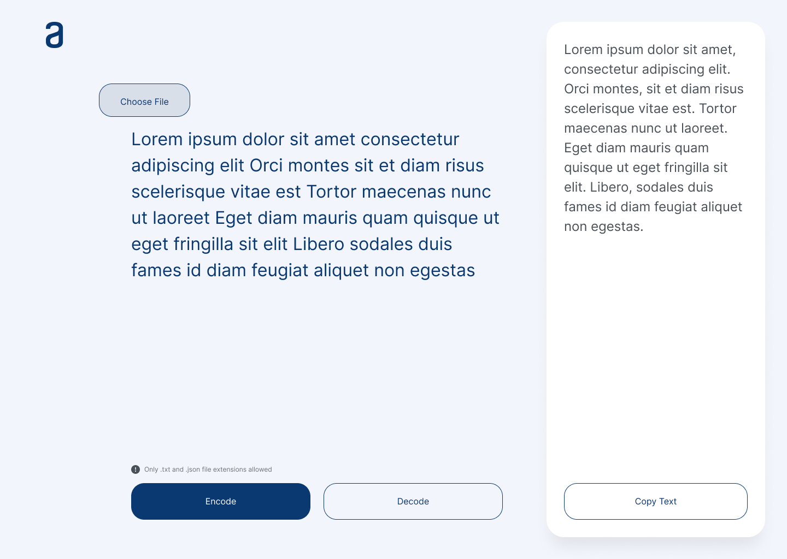

# File Encode/Decode app

This app is the one of the challenges that comprise the program: *ONE - Oracle Next Education + Alura*

Originally the challenge requirement was to create a simple text encoder with 5 key-value rules (one code for each vowel). Nevertheless, I enhanced the app by using the Base64 binary-to-text encoding scheme and also allowing files instead of text as inputs.

## Development Tools

* React
* Javasript
* Sass

### `UI`

The recommended [ Figma layout ](https://www.figma.com/file/trP3p5nEh7XUyB3n2bomjP/Alura-Challenge---Desaf%C3%ADo-1---L%C3%B3gica) provided by the Oracle-Alura program, was reconfigured and used to create the design of this responsive webpage

## Current Progress
- [x] Create UI prototype based on Figma model
- [x] Separate into react components
- [x] Encode logic for input files and text input
- [x] Decode logic for input files and text input
- [ ] Download button
- [ ] Finish up responsiveness
